**ERD**

```mermaid
erDiagram
  COMPANIES ||--o{ PROJECTS : has
  COMPANIES ||--o{ COUNTERPARTIES : has
  COMPANIES ||--o{ THREADS : has
  COMPANIES ||--o{ MEMBERSHIPS : has
  COMPANIES ||--o{ WORKERS : has
  COMPANIES ||--o{ MACHINES : has
  COMPANIES ||--o{ MATERIALS : has
  COMPANIES ||--o{ OUTSOURCING_ITEMS : has
  COMPANIES ||--o{ WORK_TYPES : has
  COMPANIES ||--o{ TRAININGS : has
  COMPANIES ||--o{ CSV_IMPORT_JOBS : has
  COMPANIES ||--o{ CLIENT_DEVICES : has
  COMPANIES ||--o{ ALERT_THRESHOLDS : has
  COMPANIES ||--o{ AUDIT_LOGS : has
  COMPANIES ||--o{ REPORT_DAILY_CUMULATIVE : has
  COMPANIES ||--o{ REPORT_WORK_TRAINING_CUMULATIVE : has

  USERS ||--o{ MEMBERSHIPS : has
  ROLES ||--o{ MEMBERSHIPS : has
  ROLES ||--o{ ROLE_PERMISSIONS : has
  PERMISSIONS ||--o{ ROLE_PERMISSIONS : has

  PROJECTS ||--o{ THREADS : has
  COUNTERPARTIES ||--o{ THREADS : has
  PROJECTS ||--o{ SCHEDULES : has
  PROJECTS ||--o{ DAILY_REPORTS : has

  THREADS ||--o{ EVENTS : has
  EVENTS ||--o{ ATTACHMENTS : has
  EVENTS ||--o{ DELIVERIES : has

  SCHEDULES ||--o{ SCHEDULE_RESOURCES : has
  DAILY_REPORTS ||--o{ DAILY_REPORT_WORKERS : has
  DAILY_REPORTS ||--o{ DAILY_REPORT_MACHINES : has
  DAILY_REPORTS ||--o{ DAILY_REPORT_MATERIALS : has
  DAILY_REPORTS ||--o{ DAILY_REPORT_OUTSOURCING : has
  DAILY_REPORTS ||--o{ DAILY_REPORT_WORK_TRAININGS : has
  DAILY_REPORTS ||--o{ ATTACHMENTS : has

  SHARE_LINKS ||--o{ ACCESS_LOGS : has
  CLIENT_DEVICES ||--o{ SYNC_TELEMETRY : has

  COMPANIES {
    string id PK
    string name
    string status
    datetime created_at
  }

  USERS {
    string id PK
    string name
    string phone
    string email
    string status
    datetime created_at
  }

  MEMBERSHIPS {
    string company_id FK
    string user_id FK
    string role_id FK
    string status
    datetime created_at
  }

  ROLES {
    string id PK
    string company_id FK
    string name
  }

  PERMISSIONS {
    string id PK
    string key UK
    string description
  }

  ROLE_PERMISSIONS {
    string role_id FK
    string permission_id FK
  }

  PROJECTS {
    string id PK
    string company_id FK
    string name
    string address
    string status
    datetime created_at
    datetime updated_at
  }

  COUNTERPARTIES {
    string id PK
    string company_id FK
    string type
    string name
    string phones
    string emails
    datetime created_at
  }

  THREADS {
    string id PK
    string company_id FK
    string project_id FK
    string counterparty_id FK
    string title
    datetime last_event_at
    string status
    datetime created_at
  }

  EVENTS {
    string id PK
    string thread_id FK
    string type
    string body
    string created_by
    datetime created_at
    string source
    string related_event_id FK
    string status
    string daily_report_id FK
  }

  UPLOADS {
    string id PK
    string company_id FK
    string created_by
    string file_name
    string mime
    int size
    string kind
    string storage_key
    string status
    datetime expires_at
    datetime completed_at
    datetime created_at
  }

  ATTACHMENTS {
    string id PK
    string event_id FK
    string daily_report_id FK
    string kind
    string file_name
    string mime
    int size
    string storage_key
    string preview_key
    string checksum
    int width
    int height
    datetime captured_at
  }

  DELIVERIES {
    string id PK
    string event_id FK
    string channel
    string to
    datetime shared_at
    string status
    string error_code
  }

  SHARE_LINKS {
    string id PK
    string target_type
    string target_id
    string token_hash UK
    datetime expires_at
    datetime revoked_at
    int access_count
    datetime last_access_at
    bool pin_enabled
  }

  ACCESS_LOGS {
    string id PK
    string share_link_id FK
    datetime accessed_at
    string ip_hash
    string ua
    string referrer
    string path
  }

  SCHEDULES {
    string id PK
    string project_id FK
    date date
    string title
    string status
    string notes
    string created_by
    datetime created_at
    datetime updated_at
  }

  SCHEDULE_RESOURCES {
    string id PK
    string schedule_id FK
    string resource_type
    string resource_id
    decimal quantity
  }

  DAILY_REPORTS {
    string id PK
    string project_id FK
    string schedule_id FK
    date date
    string notes
    string created_by
    string status
    datetime created_at
    datetime updated_at
  }

  DAILY_REPORT_WORKERS {
    string id PK
    string daily_report_id FK
    string worker_id FK
    string work_type_id FK
    decimal quantity
    decimal unit_cost
    decimal total_cost
  }

  DAILY_REPORT_MACHINES {
    string id PK
    string daily_report_id FK
    string machine_id FK
    decimal quantity
    decimal unit_cost
    decimal total_cost
  }

  DAILY_REPORT_MATERIALS {
    string id PK
    string daily_report_id FK
    string material_id FK
    decimal quantity
    decimal unit_cost
    decimal total_cost
  }

  DAILY_REPORT_OUTSOURCING {
    string id PK
    string daily_report_id FK
    string outsourcing_item_id FK
    decimal quantity
    decimal unit_cost
    decimal total_cost
  }

  DAILY_REPORT_WORK_TRAININGS {
    string id PK
    string daily_report_id FK
    string work_type_id FK
    string training_id FK
    int occurrences
    int people
  }

  WORKERS {
    string id PK
    string company_id FK
    string code
    string name
    decimal unit_cost
    bool active
  }

  MACHINES {
    string id PK
    string company_id FK
    string code
    string name
    string category
    string unit
    decimal unit_cost
    bool active
  }

  MATERIALS {
    string id PK
    string company_id FK
    string code
    string name
    string category
    string unit
    decimal unit_cost
    bool active
  }

  OUTSOURCING_ITEMS {
    string id PK
    string company_id FK
    string code
    string name
    string category
    string counterparty_id FK
    string unit
    decimal unit_cost
    bool active
  }

  WORK_TYPES {
    string id PK
    string company_id FK
    string code
    string name
    bool active
  }

  TRAININGS {
    string id PK
    string company_id FK
    string code
    string name
    int valid_years
    bool active
  }

  CSV_IMPORT_JOBS {
    string id PK
    string company_id FK
    string target
    string status
    int created_count
    int updated_count
    int error_count
    datetime created_at
  }

  CLIENT_DEVICES {
    string id PK
    string company_id FK
    string user_id FK
    string device_id UK
    string platform
    string app_version
    string os_version
    datetime last_seen_at
  }

  SYNC_TELEMETRY {
    string id PK
    string device_id FK
    int queue_size
    datetime last_sync_at
    string last_sync_status
    string last_error_reason
    datetime created_at
  }

  ALERT_THRESHOLDS {
    string id PK
    string company_id FK
    decimal sync_success_rate_warn
    decimal sync_success_rate_crit
    int sync_p95_lag_warn_seconds
    int sync_p95_lag_crit_seconds
    int offline_queue_p95_warn
    decimal upload_error_rate_warn
    decimal share_access_error_rate_warn
    datetime updated_at
  }

  REPORT_DAILY_CUMULATIVE {
    string id PK
    string company_id FK
    string project_id FK
    string period_type
    date period_start
    date period_end
    decimal labor_total
    decimal machine_total
    decimal material_total
    decimal outsourcing_total
    datetime updated_at
  }

  REPORT_WORK_TRAINING_CUMULATIVE {
    string id PK
    string company_id FK
    string project_id FK
    string period_type
    date period_start
    date period_end
    string work_type_id FK
    string training_id FK
    int occurrences_total
    int people_total
    datetime updated_at
  }

  AUDIT_LOGS {
    string id PK
    string company_id FK
    string actor_id
    string action
    string target_type
    string target_id
    datetime created_at
    string meta
  }
```

**Constraints**
- `memberships`: PRIMARY KEY(`company_id`, `user_id`)
- `memberships`: FOREIGN KEY(`company_id`) -> `companies.id`
- `memberships`: FOREIGN KEY(`user_id`) -> `users.id`
- `memberships`: FOREIGN KEY(`role_id`) -> `roles.id`
- `roles`: FOREIGN KEY(`company_id`) -> `companies.id`
- `role_permissions`: PRIMARY KEY(`role_id`, `permission_id`)
- `role_permissions`: FOREIGN KEY(`role_id`) -> `roles.id`
- `role_permissions`: FOREIGN KEY(`permission_id`) -> `permissions.id`

- `projects`: FOREIGN KEY(`company_id`) -> `companies.id`
- `counterparties`: FOREIGN KEY(`company_id`) -> `companies.id`
- `threads`: FOREIGN KEY(`company_id`) -> `companies.id`
- `threads`: FOREIGN KEY(`project_id`) -> `projects.id`
- `threads`: FOREIGN KEY(`counterparty_id`) -> `counterparties.id`
- `threads`: UNIQUE(`project_id`, `counterparty_id`)

- `events`: FOREIGN KEY(`thread_id`) -> `threads.id`
- `events`: FOREIGN KEY(`related_event_id`) -> `events.id` (nullable)
- `events`: FOREIGN KEY(`daily_report_id`) -> `daily_reports.id` (nullable)

- `uploads`: FOREIGN KEY(`company_id`) -> `companies.id`
- `attachments`: FOREIGN KEY(`event_id`) -> `events.id` (nullable)
- `attachments`: FOREIGN KEY(`daily_report_id`) -> `daily_reports.id` (nullable)
- `attachments`: UNIQUE(`storage_key`)
- `deliveries`: FOREIGN KEY(`event_id`) -> `events.id`

- `share_links`: UNIQUE(`token_hash`)
- `access_logs`: FOREIGN KEY(`share_link_id`) -> `share_links.id`

- `schedules`: FOREIGN KEY(`project_id`) -> `projects.id`
- `schedule_resources`: FOREIGN KEY(`schedule_id`) -> `schedules.id`

- `daily_reports`: FOREIGN KEY(`project_id`) -> `projects.id`
- `daily_reports`: FOREIGN KEY(`schedule_id`) -> `schedules.id` (nullable)
- `daily_report_workers`: FOREIGN KEY(`daily_report_id`) -> `daily_reports.id`
- `daily_report_workers`: FOREIGN KEY(`worker_id`) -> `workers.id`
- `daily_report_workers`: FOREIGN KEY(`work_type_id`) -> `work_types.id` (nullable)
- `daily_report_machines`: FOREIGN KEY(`daily_report_id`) -> `daily_reports.id`
- `daily_report_machines`: FOREIGN KEY(`machine_id`) -> `machines.id`
- `daily_report_materials`: FOREIGN KEY(`daily_report_id`) -> `daily_reports.id`
- `daily_report_materials`: FOREIGN KEY(`material_id`) -> `materials.id`
- `daily_report_outsourcing`: FOREIGN KEY(`daily_report_id`) -> `daily_reports.id`
- `daily_report_outsourcing`: FOREIGN KEY(`outsourcing_item_id`) -> `outsourcing_items.id`
- `daily_report_work_trainings`: FOREIGN KEY(`daily_report_id`) -> `daily_reports.id`
- `daily_report_work_trainings`: FOREIGN KEY(`work_type_id`) -> `work_types.id`
- `daily_report_work_trainings`: FOREIGN KEY(`training_id`) -> `trainings.id`

- `workers`: FOREIGN KEY(`company_id`) -> `companies.id`
- `machines`: FOREIGN KEY(`company_id`) -> `companies.id`
- `materials`: FOREIGN KEY(`company_id`) -> `companies.id`
- `outsourcing_items`: FOREIGN KEY(`company_id`) -> `companies.id`
- `outsourcing_items`: FOREIGN KEY(`counterparty_id`) -> `counterparties.id` (nullable)
- `work_types`: FOREIGN KEY(`company_id`) -> `companies.id`
- `trainings`: FOREIGN KEY(`company_id`) -> `companies.id`

- `csv_import_jobs`: FOREIGN KEY(`company_id`) -> `companies.id`
- `client_devices`: UNIQUE(`device_id`)
- `client_devices`: FOREIGN KEY(`company_id`) -> `companies.id`
- `client_devices`: FOREIGN KEY(`user_id`) -> `users.id`
- `sync_telemetry`: FOREIGN KEY(`device_id`) -> `client_devices.id`

- `alert_thresholds`: UNIQUE(`company_id`)
- `alert_thresholds`: FOREIGN KEY(`company_id`) -> `companies.id`

- `report_daily_cumulative`: FOREIGN KEY(`company_id`) -> `companies.id`
- `report_daily_cumulative`: FOREIGN KEY(`project_id`) -> `projects.id`
- `report_work_training_cumulative`: FOREIGN KEY(`company_id`) -> `companies.id`
- `report_work_training_cumulative`: FOREIGN KEY(`project_id`) -> `projects.id`
- `report_work_training_cumulative`: FOREIGN KEY(`work_type_id`) -> `work_types.id`
- `report_work_training_cumulative`: FOREIGN KEY(`training_id`) -> `trainings.id`

- `audit_logs`: FOREIGN KEY(`company_id`) -> `companies.id`
