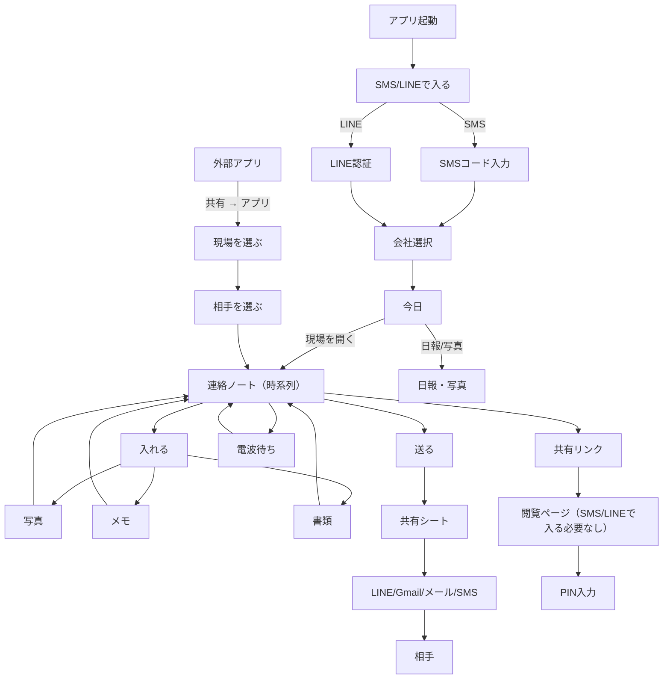

**UI Flow (Contact Note)**


**Wireframes + 状態**
```text
[SMS/LINEで入る]
-------------------------------------------------
  かんたんSMS/LINEで入る
  [SMSで入る]   [LINEで入る]

  できないとき
  ・電波が弱い → あとでOK
-------------------------------------------------

[SMSコード入力]
-------------------------------------------------
  電話番号
  [090-xxxx-xxxx]
  [コードを送る]

  コード入力
  [_ _ _ _ _ _]
  [入る]

  状態:
  - 送信中
  - 期限切れ → [もう一度送る]
  - コードが違う → もう一度入れる
-------------------------------------------------

[会社選択]
-------------------------------------------------
  会社を選ぶ
  ・○○建設
  ・△△設備
  [この会社で進む]
-------------------------------------------------

[今日]
-------------------------------------------------
  きょうの予定
  ・A現場 08:30〜  相手: ○○建材
    [連絡を見る]  [日報]
  ・B現場 13:00〜  相手: △△設備
    [連絡を見る]  [日報]

  直近の連絡
  ・A現場 / ○○建材 きょう 10:12
    「工程表を共有しました」

  右下の大ボタン
  [入れる]

  状態:
  - 読み込み中（骨組み表示）
  - 電波待ち（あとで送る）
-------------------------------------------------

[連絡] A現場 / ○○建材
-------------------------------------------------
  [入れる]  [撮る]  [送る]

  きょう 10:12 受領
  「工程表（最新版）」
  [見る]  [送る]

  きょう 09:45 写真 3枚
  「配管立ち上がり」
  [見る]  [送る]

  きょう 08:50 送信
  「見積PDF」
  [送る]  [共有リンク]

  状態:
  - 送信中
  - 電波待ち（あとで送る）
  - 失敗 → もう一度送る
-------------------------------------------------

[日報・写真]
-------------------------------------------------
  きょうの作業
  [音声で入れる]  [入力する]

  写真
  [撮る]  [選ぶ]

  送信
  [送る]

  状態:
  - 保存中 → 画面は止めない
-------------------------------------------------

[閲覧ページ（SMS/LINEで入る必要なし）]
-------------------------------------------------
  A現場 / ○○建材
  共有リンク: 有効（7日）

  ・工程表（最新版）
  ・見積PDF
  ・写真 3枚

  このページは閲覧のみです

  PINが必要な場合
  [PINを入れる]  [_ _ _ _]
  [見る]

  状態:
  - 期限切れ → 「期限が切れました」
  - PINが違う → 「PINが違います」
-------------------------------------------------
```

**文言ルール**
- ボタンは短い動詞のみ: `入れる` `撮る` `送る` `見る`
- 状態表示は責めない: `電波待ち（あとで送る）`
- 「見た記録」以外は使わない: `見た記録` のみ表示
